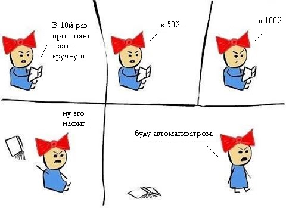
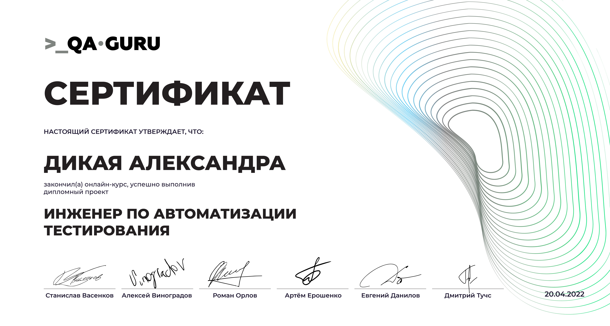

### Всем привет :heartpulse:

когда-то один маленький ручной тестировщик заколебался тыкать сайт вручную и решил выучиться на автотестера...

пройден курс в :star2: <a target="_blank" href="https://qa.guru/">QA.GURU</a> :star2: история моей боли остается за кадром, а тут ниже можно увидеть мои достижения за время учебы

:purple_heart: автотесты на UI <a target="_blank" href="https://github.com/SashkaDikaya/Diploma/">Diploma</a> (там красиво) 

:sparkling_heart: автотесты на API <a target="_blank" href="https://github.com/SashkaDikaya/DiplomaAPI">DiplomaAPI</a>

 

<!--
**SashkaDikaya/SashkaDikaya** is a ✨ _special_ ✨ repository because its `README.md` (this file) appears on your GitHub profile.

Here are some ideas to get you started:

- 🔭 I’m currently working on ...
- 🌱 I’m currently learning ...
- 👯 I’m looking to collaborate on ...
- 🤔 I’m looking for help with ...
- 💬 Ask me about ...
- 📫 How to reach me: ...
- 😄 Pronouns: ...
- ⚡ Fun fact: ...
-->
